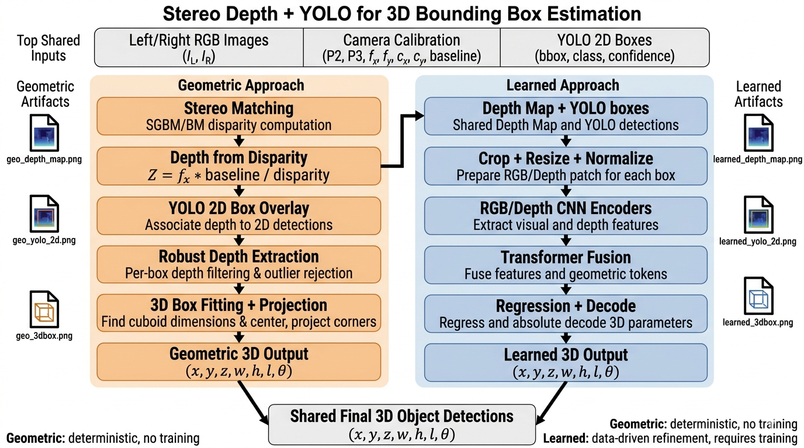
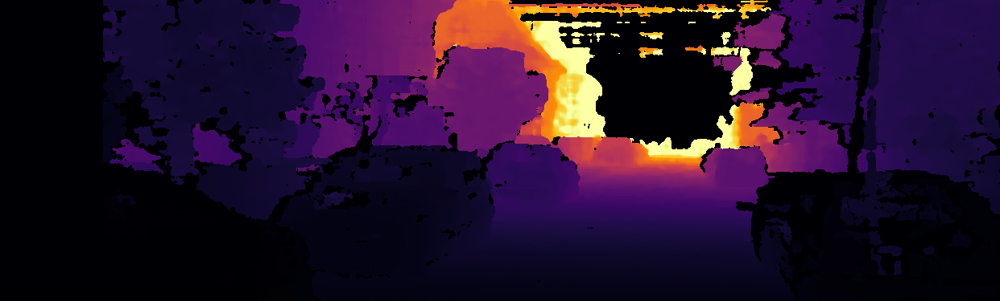
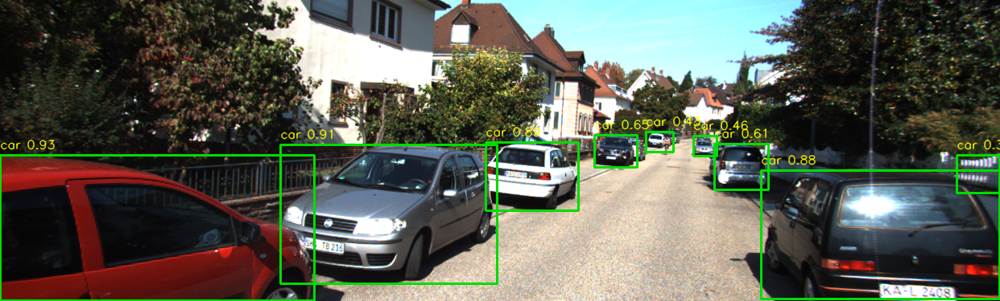
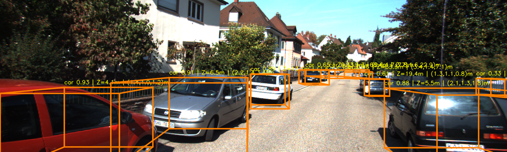
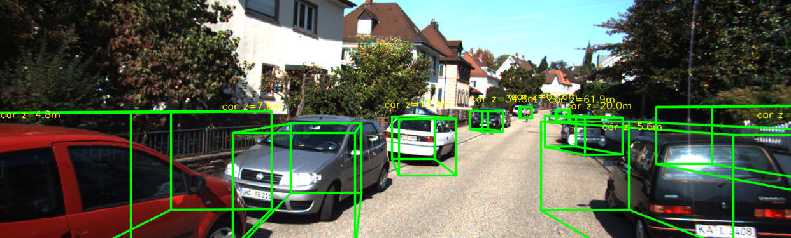

# Stereo Object Detection (3D)

This module implements a full stereo-based 3D object detection workflow for KITTI.

It contains two complementary approaches:

- **Geometric baseline**: deterministic pipeline using stereo depth + YOLO detections.
- **Learned fusion model**: uses RGB-depth crops and geometry features to regress 3D box parameters.

The project is designed to be practical and modular: you can run single-image inference, train a learned model, and compare baseline vs learned quantitatively.

---

## 1) Objective

The goal is to estimate object-level 3D information from stereo images:

- object center in camera coordinates `(x, y, z)`
- 3D dimensions `(w, h, l)`
- yaw/orientation `theta`

using 2D detections as proposals.

Why this approach:

- Stereo gives metric depth directly (no LiDAR needed).
- YOLO gives robust 2D object localization.
- Geometric fitting provides a strong, interpretable baseline.
- Learned fusion can improve depth/center estimation in difficult scenes.

---

## 2) Architecture



High-level flow:

1. Load KITTI stereo pair + calibration.
2. Compute disparity and depth map.
3. Detect objects with YOLO.
4. Estimate 3D box either by:
   - geometric depth fitting, or
   - learned RGB-depth regression.
5. Project 3D box back to image and evaluate.

---

## 3) Methodology (Step by Step)

## 3.1 Input and calibration

For each sample:

- Left image (`image_2`), right image (`image_3`)
- Camera calibration (`P2`, `P3`, intrinsics, baseline)
- (Training only) KITTI labels for evaluation/training targets

## 3.2 Stereo depth estimation

Stereo matching is done with OpenCV:

- `SGBM` (default) or `BM`
- Disparity -> depth conversion:
  - `depth = (fx * baseline) / disparity`

This produces a depth map in meters.

## 3.3 2D object detection

YOLOv8 detects objects in the left image.

Each detection gives:

- class label
- confidence
- 2D bounding box `(x1, y1, x2, y2)`

## 3.4 Geometric baseline branch

For each detection:

1. Extract depth values inside bbox.
2. Keep valid depths in range.
3. Apply robust filtering (median + MAD based rejection).
4. Estimate object depth and back-project to 3D.
5. Fit 3D cuboid bounds.
6. Project 3D corners to 2D for visualization.

Strengths:

- no training needed
- fast and explainable

Limitations:

- sensitive to stereo noise and background pixels inside bbox

## 3.5 Learned branch

The learned pipeline uses stereo + YOLO to build supervised training crops:

1. Match YOLO detections to GT labels by IoU.
2. Create 4-channel crop per detection:
   - RGB (3 channels)
   - depth (1 channel)
3. Build bbox geometry features (normalized center, size, aspect, area, etc.).
4. Compute anchor from robust bbox depth.
5. Train model to predict residualized 3D parameters:
   - `(dx, dy, dz, log(w), log(h), log(l), sin(theta), cos(theta))`

At inference:

- model predicts residuals,
- values are decoded with anchor to final 3D box.

Model used here:

- `StereoFusion3DNet` (dual encoder + transformer encoder + MLP head).

---

## 4) Repository Structure and File-Level Explanation

```text
stereo_object_detection/
├── arch.png
├── README.md
├── requirements.txt
├── configs/
│   └── stereo_sgbm.json
├── geometric/
│   ├── run_geo.py
│   ├── depth.py
│   ├── yolo_detect.py
│   └── fusion_math.py
├── learned/
│   ├── train.py
│   ├── infer.py
│   ├── dataset.py
│   ├── model.py
│   └── utils.py
├── scripts/
│   ├── compare_baseline_vs_dl.py
│   ├── run_stereo_demo.py
│   ├── run_fusion_demo.py
│   ├── run_dl_3d_demo.py
│   └── train_3d_head.py
├── src/kitti_stereo/
│   ├── kitti_data.py
│   ├── stereo_depth.py
│   ├── detection.py
│   ├── geometry_3d.py
│   ├── box3d.py
│   ├── fusion.py
│   ├── depth_pipeline.py
│   └── approaches/
│       ├── geometric/
│       └── learned/
└── outputs/
```

### `geometric/` files

- `run_geo.py`
  - End-to-end geometric runner.
  - Saves `*_geo_depth_map.png`, `*_geo_yolo_2d.png`, `*_geo_3dbox.png`.
- `depth.py`
  - Stereo depth wrapper.
- `yolo_detect.py`
  - YOLO wrapper.
- `fusion_math.py`
  - 3D box estimation and drawing wrappers.

### `learned/` files

- `dataset.py`
  - Builds training samples by matching YOLO boxes to GT.
  - Creates RGB-depth crops + geometry features + regression targets.
- `model.py`
  - `StereoFusion3DNet` definition and loss.
- `train.py`
  - Training loop, split, optimizer, checkpoint saving.
- `infer.py`
  - Single-image learned inference and visualization outputs.
- `utils.py`
  - Crop creation, feature building, anchor computation, target encode/decode.

### `scripts/` files

- `compare_baseline_vs_dl.py`
  - Quantitative comparison (baseline vs learned).
  - Saves `baseline_vs_dl_metrics.json` and `.txt`.
  - Supports both checkpoint styles (`legacy_stereo_fusion` and `rgbd_transformer`).
- `run_stereo_demo.py`, `run_fusion_demo.py`, `run_dl_3d_demo.py`
  - Focused demos for stereo/depth, geometric fusion, learned 3D demos.
- `train_3d_head.py`
  - Training path for the newer transformer head in `src/kitti_stereo/approaches/learned`.

### `src/kitti_stereo/`

Core reusable implementation layer used by all front-end scripts:

- KITTI IO and calibration parsing
- stereo utilities
- detection interfaces
- geometry projection helpers
- geometric and learned approach modules

---

## 5) Models Used

### Detection model

- **YOLOv8n**
- Default checkpoint path in geometric/learned runners: `stereo_object_detection/yolov8n.pt`

### Learned 3D model (current outputs)

- **StereoFusion3DNet** (legacy learned fusion checkpoint)
- Checkpoint: `outputs/learned_fusion_3d.pt`

### Optional newer learned head

- `RGBDTransformer3DHead` (available in `src/kitti_stereo/approaches/learned`)
- Supported by comparison script as well.

---

## 6) Installation

From repo root:

```bash
cd /home/b23bb1032/prakhar_cv
.venv311/bin/python -m pip install -r stereo_object_detection/requirements.txt
```

Expected dependencies:

- `numpy>=1.24`
- `opencv-python>=4.8`
- `matplotlib>=3.7`
- `ultralytics>=8.2`
- `torch>=2.0`

---

## 7) How to Run

## 7.1 Geometric inference (single image)

```bash
.venv311/bin/python stereo_object_detection/geometric/run_geo.py \
  --dataset-root /home/b23bb1032/prakhar_cv/dataset \
  --split training \
  --sample-id 000008 \
  --save-dir /home/b23bb1032/prakhar_cv/stereo_object_detection/outputs \
  --no-show
```

## 7.2 Learned training

```bash
.venv311/bin/python stereo_object_detection/learned/train.py \
  --dataset-root /home/b23bb1032/prakhar_cv/dataset \
  --max-frames 300 \
  --epochs 8 \
  --batch-size 16 \
  --save-path /home/b23bb1032/prakhar_cv/stereo_object_detection/outputs/learned_fusion_3d.pt
```

## 7.3 Learned inference (single image)

```bash
.venv311/bin/python stereo_object_detection/learned/infer.py \
  --dataset-root /home/b23bb1032/prakhar_cv/dataset \
  --split training \
  --sample-id 000008 \
  --checkpoint /home/b23bb1032/prakhar_cv/stereo_object_detection/outputs/learned_fusion_3d.pt \
  --save-dir /home/b23bb1032/prakhar_cv/stereo_object_detection/outputs \
  --no-show
```

## 7.4 Baseline vs learned comparison

```bash
.venv311/bin/python stereo_object_detection/scripts/compare_baseline_vs_dl.py \
  --dataset-root /home/b23bb1032/prakhar_cv/dataset \
  --checkpoint /home/b23bb1032/prakhar_cv/stereo_object_detection/outputs/learned_fusion_3d.pt \
  --start-id 0 --num-samples 10 \
  --save-dir /home/b23bb1032/prakhar_cv/stereo_object_detection/outputs
```

---

## 8) 000008 Visual Results

The following figures are generated for sample `000008`.

## 8.1 Geometric pipeline outputs

### Geometric depth map



### Geometric YOLO 2D detections



### Geometric 3D boxes



Figure text meaning (`geo_3dbox`):

- `class confidence | Z=...m | (w,h,l)m`
- `Z`: estimated object depth in meters
- `(w,h,l)`: estimated 3D dimensions in meters
- orange wireframe: projected 3D cuboid

## 8.2 Learned pipeline outputs

### Learned depth map


### Learned YOLO 2D detections


### Learned 3D boxes



Figure text meaning (`learned_3dbox`):

- `class z=...m`
- `z`: decoded center depth from learned prediction + anchor
- green wireframe: projected learned 3D cuboid

---

## 9) Evaluation Metrics and Latest Results

Comparison source files:

- `outputs/baseline_vs_dl_metrics.json`
- `outputs/baseline_vs_dl_metrics.txt`

Current summary (10 requested training samples):

- processed samples: `10`
- matches: `20`
- checkpoint mode: `legacy_stereo_fusion`

| Metric | Geometric Baseline | Learned Fusion | Improvement (Learned vs Baseline) |
|---|---:|---:|---:|
| Depth MAE (m) | 1.242 | 1.185 | **+4.62% better** |
| Center L2 mean (m) | 1.579 | 1.266 | **+19.80% better** |
| Mean IoU2D | 0.866 | 0.866 | 0.00 (same) |

How to interpret:

- Lower `Depth MAE` is better.
- Lower `Center L2` is better.
- Higher `IoU2D` is better.

In this run, learned fusion improves depth and 3D center accuracy while keeping 2D localization compatibility unchanged.

---

## 10) Findings and Practical Conclusion

### Findings

- Geometric baseline is strong, fast, and transparent.
- Learned fusion improves average depth and center accuracy on evaluated samples.
- Stereo quality remains a key bottleneck for both branches.

### Reasoning behind improvements

- Learned branch uses both local RGB texture and depth context.
- It predicts residuals relative to an anchor, which stabilizes regression.
- This helps when bbox depth has mixed foreground/background pixels.

### Conclusion

- Use **geometric** for fast, deterministic baseline and debugging.
- Use **learned fusion** when you want better average 3D accuracy and can support training/inference compute.

---

## 11) Limitations and Next Steps

- Performance depends on stereo quality, calibration, and domain shift.
- Current learned checkpoint is a legacy architecture; testing newer transformer heads can help.
- Useful upgrades:
  1. stronger detector backbone,
  2. mask-guided depth regions,
  3. class-wise threshold tuning,
  4. larger and more diverse training subsets.

