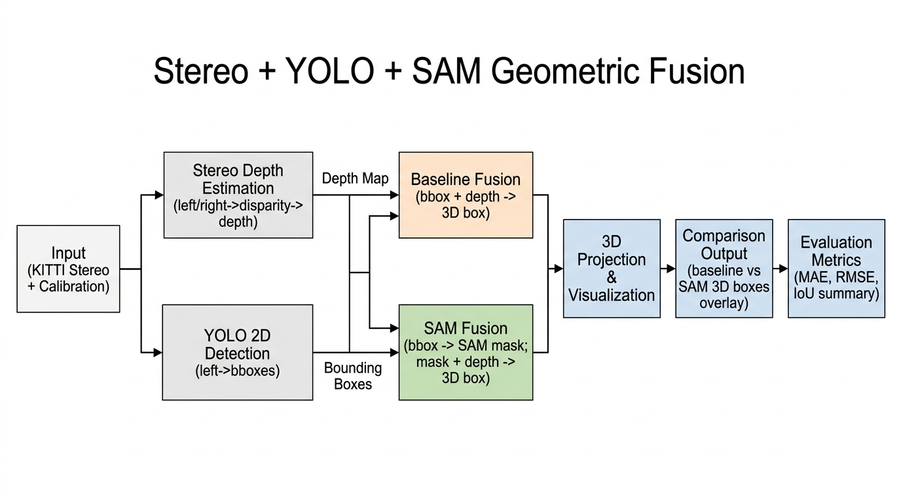
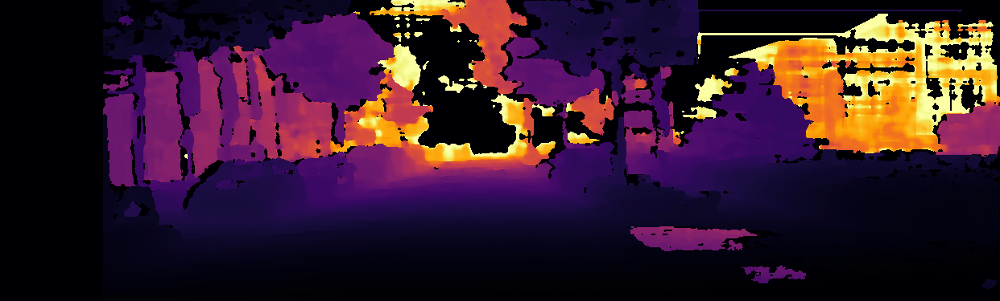
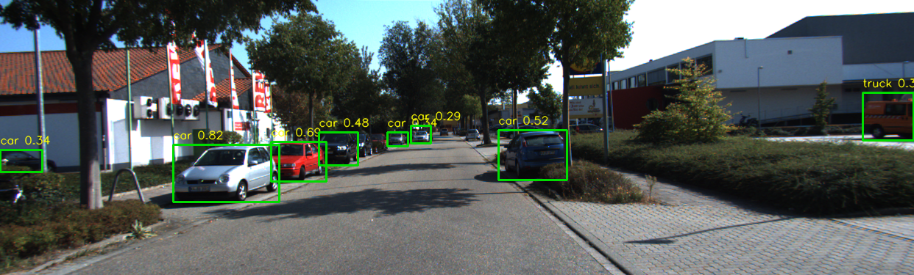
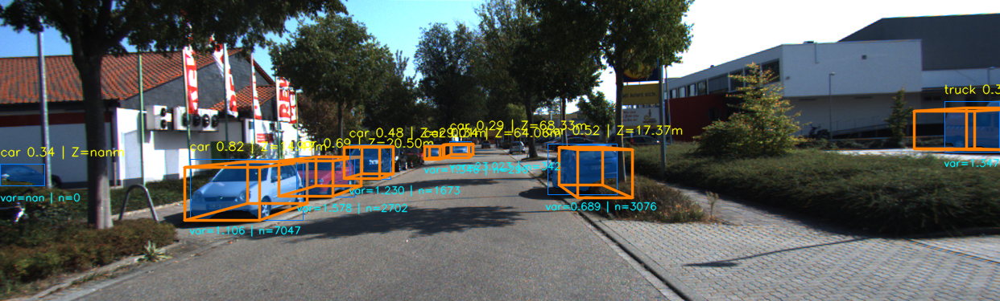

# Stereo + YOLO + SAM Geometric Fusion

This folder contains a complete geometric 3D perception pipeline that combines:

- stereo depth from left-right images,
- YOLO 2D detections,
- SAM masks guided by YOLO boxes,
- robust depth filtering,
- 3D box fitting + projection.

The goal is to compare two approaches on the same detections:

- **Baseline**: YOLO bbox + stereo depth
- **Proposed**: YOLO bbox -> SAM mask + stereo depth

---

## 1) Objective

The objective is to improve 3D object localization quality by using a cleaner depth region.

Why this matters:

- A raw YOLO box usually includes background pixels.
- Background depth can corrupt object depth estimates.
- SAM mask helps isolate object pixels inside the YOLO box.
- Cleaner depth points can improve 3D fit stability.

---

## 2) Architecture



High-level flow:

1. Load KITTI stereo pair + calibration.
2. Compute disparity and depth map (SGBM/BM).
3. Detect 2D objects with YOLO.
4. Run two branches:
   - Baseline branch uses bbox region.
   - Proposed branch uses SAM mask region.
5. Apply robust depth filtering in both branches.
6. Back-project depth to 3D, fit 3D cuboid, project to image.
7. Save visual outputs and compute metrics vs GT (training split).

---

## 3) Methodology (Simple but Deep)

### 3.1 Stereo depth

- Input: left and right images.
- Stereo matcher: `sgbm` (default) or `bm`.
- Output:
  - disparity map
  - depth map in meters using focal length + baseline from calibration.

### 3.2 2D detection (YOLO)

- YOLO runs on the left image.
- For each detection: class, confidence, bbox `(x1, y1, x2, y2)`.

### 3.3 SAM-guided segmentation

- Each YOLO bbox is used as a prompt to SAM.
- SAM returns a mask per detection.
- This mask is used as the object depth region in the proposed branch.

### 3.4 Robust depth filtering

Inside each region (bbox or SAM mask), filtering is applied:

1. Valid depth range filter (`min_depth_m`, `max_depth_m`)
2. Percentile clipping (`lower_percentile`, `upper_percentile`)
3. MAD-based outlier rejection
4. Final depth = **median** of filtered values

Additional stats:

- depth variance (`var`)
- number of depth points (`n`)

### 3.5 3D box estimation

- Depth pixels are back-projected to 3D camera coordinates.
- 3D bounds are estimated from robust inlier points.
- 8 cuboid corners are generated.
- 3D corners are projected to 2D using calibration `P2`.

---

## 4) File Structure (This Folder)

```text
stereo_sam_object_detection/
├── README.md
├── arch.png
├── run.py
├── stereo.py
├── yolo.py
├── sam_segment.py
├── fusion.py
├── utils.py
└── outputs/
    ├── sam/
    │   ├── depth_map/
    │   ├── yolo_2d/
    │   ├── segmented/
    │   └── fusion_3d/
    └── metrics/
        ├── comparison_metrics.json
        └── comparison_metrics.txt
```

Main external comparison output is also written to:

- `../outputs/stereo_sam_vs_baseline/`

---

## 5) What Each Code File Does

### `run.py`

- Main pipeline orchestrator.
- Loads samples, runs stereo + YOLO + SAM + fusion.
- Saves visual outputs and metric reports.
- Supports random sample selection.

### `stereo.py`

- Calls reusable stereo utilities from `stereo_object_detection/src/kitti_stereo`.
- Computes disparity and converts to depth map.

### `yolo.py`

- Wrapper over shared YOLO inference utility.
- Returns detection objects in unified format.

### `sam_segment.py`

- Loads SAM model/checkpoint.
- Uses YOLO bboxes as prompts.
- Returns one mask per detection.

### `fusion.py`

- Core geometry + filtering logic.
- Builds baseline and SAM-fusion predictions.
- Projects 3D boxes for visualization.
- Computes match-based evaluation stats.

### `utils.py`

- Path setup and KITTI sample loading helpers.
- Visualization helpers (mask overlay, depth colormap, etc.).

---

## 6) Models Used

### YOLO

- Default model: `yolov8n.pt`
- Location: repo root (`/home/b23bb1032/prakhar_cv/yolov8n.pt`)
- Task: 2D object detection

### SAM

- Default model type: `vit_b`
- Default checkpoint: `sam_b.pt`
- Location: repo root (`/home/b23bb1032/prakhar_cv/sam_b.pt`)
- Task: segmentation masks from YOLO bbox prompts

---

## 7) How to Run

From repo root:

```bash
cd /home/b23bb1032/prakhar_cv
```

Install SAM (if not installed):

```bash
.venv311/bin/python -m pip install git+https://github.com/facebookresearch/segment-anything.git
```

Run 10 random training samples:

```bash
.venv311/bin/python stereo_sam_object_detection/run.py \
  --split training \
  --num-samples 10 \
  --random-samples \
  --random-seed 42
```

Run a single sample:

```bash
.venv311/bin/python stereo_sam_object_detection/run.py \
  --split training \
  --sample-id 006033
```

---

## 8) Metrics Used

Metrics are computed by matching predictions to GT objects (training split) using IoU threshold.

- **MAE (depth)**: mean absolute depth error (meters)
- **RMSE (depth)**: root mean square depth error (meters)
- **RMSE improvement %**:  
  `100 * (RMSE_baseline - RMSE_sam) / RMSE_baseline`
- **Mean depth variance**: average variance of filtered depth points per object
- **Projected IoU**: IoU between projected 3D box bbox and GT 2D bbox
- **Region IoU**: IoU between used region bbox (bbox or SAM-region bbox) and GT 2D bbox

Lower is better for: `MAE`, `RMSE`, `mean_var`  
Higher is better for: `proj_iou`, `region_iou`

---

## 9) Result Summary (10 samples, seed=42)

Source:

- `outputs/metrics/comparison_metrics.json`
- `outputs/metrics/comparison_metrics.txt`

Run details:

- attempted samples: `10`
- matched objects: `34`
- split: `training`
- IoU match threshold: `0.3`

| Metric | Baseline | SAM Fusion | Change (SAM - Baseline) | Interpretation |
|---|---:|---:|---:|---|
| MAE (m) | 1.6018 | 1.9792 | +0.3774 (+23.56%) | Worse |
| RMSE (m) | 2.6220 | 3.6564 | +1.0344 (+39.45%) | Worse |
| Mean depth variance | 2.7628 | 2.6309 | -0.1319 (-4.78%) | Better (more stable) |
| Projected IoU | 0.6734 | 0.7092 | +0.0359 (+5.33%) | Better |
| Region IoU | 0.7874 | 0.7688 | -0.0186 (-2.36%) | Slightly worse |

RMSE improvement reported by code:

- **`-39.45%`** (negative means SAM branch is worse on RMSE for this run).

---

## 10) Findings and Conclusion

### Key findings

- SAM branch produced **better projected IoU** and **lower depth variance**.
- But in this run, SAM branch had **higher MAE/RMSE** depth error.

### Practical interpretation

- SAM masks made depth points more internally consistent.
- However, mask misses/over-segmentation in some objects likely removed useful depth points or biased depth median.
- This can improve some geometric consistency while still hurting final depth accuracy.

### Conclusion

- The proposed SAM-guided region selection is promising for cleaner geometry, but it is not automatically better on depth error in every setup.
- Better prompt strategy, mask quality control, and fallback logic may improve robustness.

---

## 11) Visual Examples (Sample `006033`)

### Depth Map



What it shows:

- Relative depth distribution in the scene.
- Colormap is percentile-normalized for visualization, so it is mainly for visual comparison, not direct absolute reading.

### YOLO 2D Detections



What numbers mean:

- `class confidence` (for example `car 0.88`)
- Bounding box is 2D detection only (no depth yet).

### SAM Fusion 3D Output



What numbers/graphics mean:

- Orange wireframe: projected 3D cuboid.
- Text line 1 example: `car 0.88 | Z=4.95m`
  - class label
  - YOLO confidence
  - estimated object depth `Z` in meters
- Text line 2 example: `var=0.106 | n=16817`
  - `var`: depth variance of filtered points for this object
  - `n`: number of depth pixels used after filtering
- SAM mask overlay is blended on the object region.

---

## 12) Notes / Limitations

- Metrics require `training` split because GT labels are needed.
- Results can change with:
  - sample selection
  - stereo parameters
  - YOLO confidence/IoU thresholds
  - SAM model/checkpoint quality
- A strong improvement in one metric does not guarantee improvement in all metrics.

---


